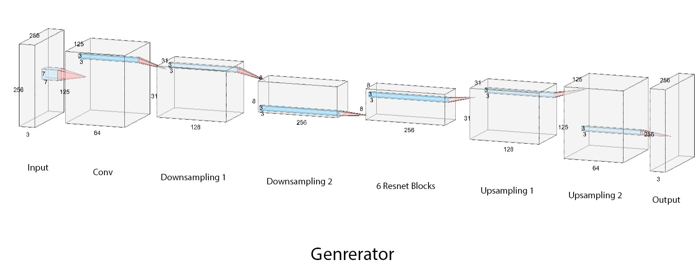
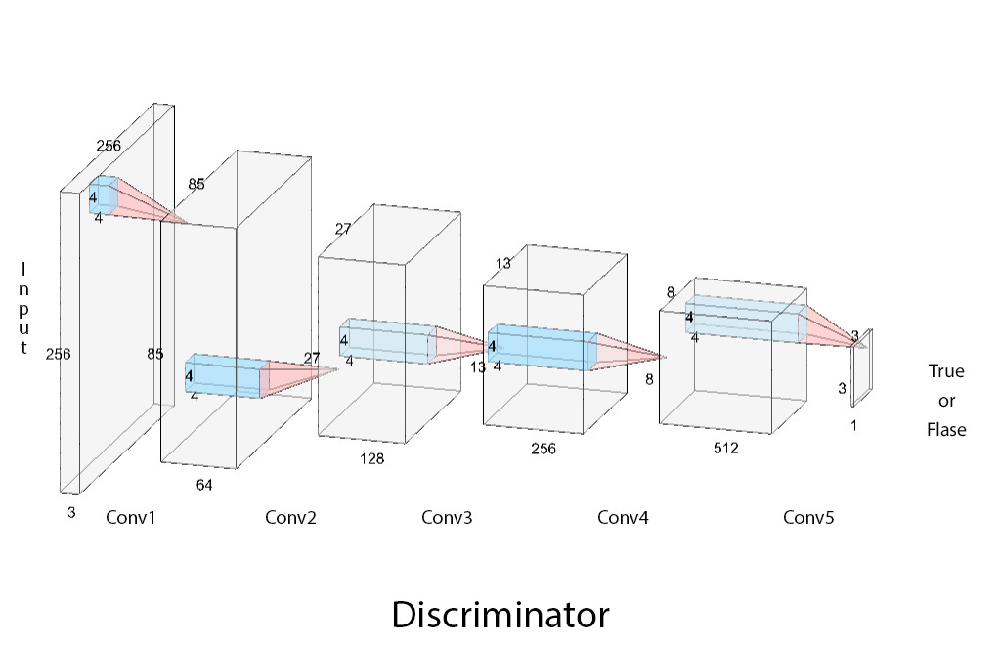

# Underwater Image Enhancement

## CycleGan Model


## Model Architecture

### 1. Generator


### 2. Discriminator


## Running Test
```bash
python test.py --model cyclegan2 --preprocess RAC --load_model 20 --examples 2 --phase train --visuals

python test.py --model cyclegan2 --preprocess RAC --load_model 103 --examples 20 --phase train --save_artifacts --all_metrics --log_out
```

## Metric

- PSNR
- SSIM
- Entropy
- UIQM - under water image quality metric = `c1 + UICM + c2 * UISM + c3 * UIConM` (c1=0.0282, c2=0.2953, c3=3.5753)

## Milestone

- Create a PPT about matrices
- Create a metric table

## Notes
1. Inside `model` model files should have the name `models/[model_name]_model.py`, 
   different models can be imported by the `model` opt
   
python train.py --model cyclegan2 --preprocess RRC --num_gpus 1 --cloud colab --training-data-dir dataset --ct 20 --gan_mode vanilla